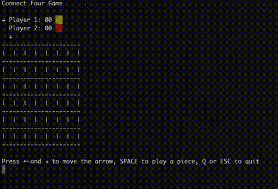

# connect-four-rust
**Connect 4** implementation as a Rust game for terminal

This project was just meant as a quick exercise to learn Rust.

Each of the two players can be human or a bot.
So far there are two types of bots implemented:
- random: a bot that plays randomly.
- minimax: a bot that uses the Minimax algorithm.

But can easily be extended to include more bots with other strategies.

USAGE:
    connect_four [OPTIONS]

FLAGS:
    -h, --help       Prints help information
    -V, --version    Prints version information

OPTIONS:
    -1, --player1 <player1_type>     [default: human]  [possible values: human, random, minimax]
    -2, --player2 <player2_type>     [default: human]  [possible values: human, random, minimax]    
    
